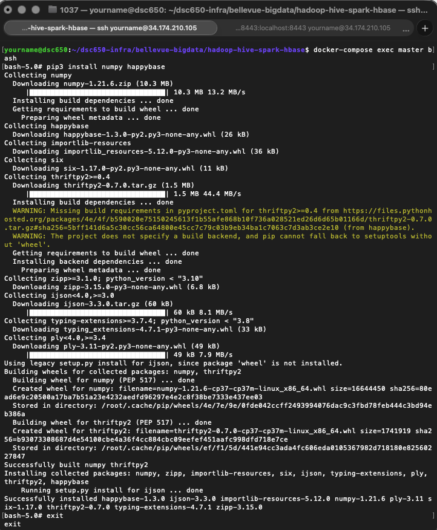
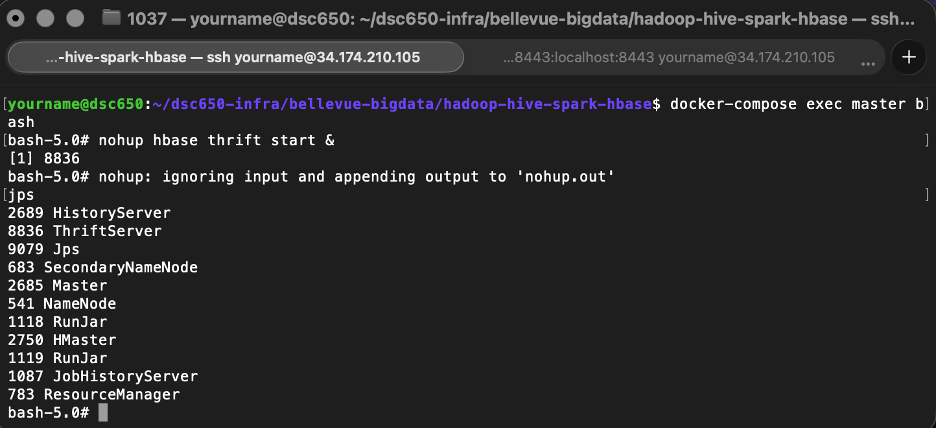

# Project Summary

## Implementation Overview

This project implements an end-to-end big data pipeline that ingests, stores, processes, and analyzes network traffic data related to web-based cyberattacks, demonstrating integration across six core components of the Hadoop and Spark ecosystem: NiFi, HDFS, Hive, YARN, Spark (with MLlib), and HBase.

The dataset is CloudWatch Traffic Web Attack data with each record describing a single traffic event with fields like source and destination IP, byte counts in and out, protocol, response code, country code, and the detection rule that flagged it. Unlike a labeled intrusion-detection dataset with a clean benign/malicious split, every record here is already a known suspicious event, which shapes the machine learning approach taken downstream.

The purpose of the pipeline is to take that raw traffic data from its source, move it reliably through progressively more structured storage and processing layers, apply an unsupervised machine learning model to surface patterns in traffic volume, and persist both the model's predictions and its evaluation metrics into a low-latency store, demonstrating a realistic architecture for how a security analytics platform might process and expose this kind of data at scale.

**Source Data → NiFi → HDFS → Hive → Spark MLlib → HBase**

Spark execution is submitted through **YARN**.

## Dataset

**Dataset name:** Cybersecurity: Suspicious Web Threat Interactions, Cloudwatch_Traffic_Web_Attack.csv  
**GitHub direct URL:** https://raw.githubusercontent.com/cincodemarcho/dsc650-final-project/refs/heads/main/sample-data/CloudWatch_Traffic_Web_Attack.csv   
**Kaggle source link:** https://www.kaggle.com/datasets/jancsg/cybersecurity-suspicious-web-threat-interactions

This dataset contains web traffic records collected through AWS CloudWatch, aimed at detecting suspicious activities and potential attack attempts. The data was generated by monitoring traffic to a production web server, using various detection rules to identify anomalous patterns. This dataset is ideal for anomaly detection to develop models to detect unusual behaviors in web traffic.

## Environment Setup

Beyond the core Hadoop/Spark ecosystem components, the pipeline depends on a small set of environment-level prerequisites that had to be installed and running before the Spark ML stage could complete successfully: numpy and happybase. Numpy provides access to VectorAssembler, StandadrdScaler, and KMeans libraries. Happybase doesn't talk to HBase directly through its native RPC protocol. It connects over Thrift, a cross-language RPC framework, meaning something on the HBase side has to be listening for Thrift connections and translating them into actual HBase operations.

### Package Installation Evidence

### HBase Thrift Server Evidence

## What Worked

By the end of this project, all six required components were integrated and functioning together as a single pipeline. NiFi successfully retrieved the CloudWatch traffic dataset from its source URL and wrote it to HDFS. Hive successfully loaded that data into a managed table (cloudwatch_web_attacks) and correctly served queries against it. HBase was created and successfully received data written directly from the Spark job. Spark itself trained a K-Means clustering model against the Hive-sourced data, executing distributed tasks across the cluster's worker nodes under YARN's coordination, and evaluated the resulting model with a silhouette score and WSSE. Finally, the Spark driver connected to HBase over Thrift via happybase and wrote both per-record predictions and a summary of the model's evaluation metrics back into HBase.

## Issues & Challenges Encountered

HBase table disappearing between sessions:
- What happened: A scan 'cloudwatch_web_attacks' that had worked earlier later failed with ERROR: Unknown table cloudwatch_web_attacks!The table itself was gone, not just empty.
- How I investigated it: Since this happened independently of anything in the Spark code, I checked docker-compose ps for evidence the HBase container had restarted.
- What I changed or fixed: Simply recreated the table with the original create command. 
- What I learned: Things erase after you exit/disconnect without a persistent solution.

The source CSV itself vanished from HDFS:
- What happened: hdfs dfs -ls -R /usr/hive/warehouse/ showed the cloudwatch_web_attacks directory existing but empty — no CSV file inside it, despite one having been confirmed there the day before. A follow-up check of /tmp/ showed the same thing: the file was gone from there too.
- How I investigated it: RI checked every plausible location the file could be — the Hive warehouse directory, /tmp, and a full recursive filesystem search. It was gone.
- What I changed or fixed: Re-ran the original NiFi flow (InvokeHTTP → UpdateAttribute → PutHDFS) to re-download and re-ingest the CSV from its source URL, restoring it to /tmp.
- What I learned: The underlying HDFS storage was also not surviving between sessions. It also reinforced a separate, more mechanical lesson: LOAD DATA INPATH moves files rather than copying them, so even in a stable environment, re-running a load step against the same path a second time would fail simply because the file is no longer there after the first successful load.

## Results

Data moved cleanly through every stage of the pipeline: 282 records were ingested by NiFi, loaded into Hive, confirmed via an aggregation query (SELECT protocol, COUNT(*), AVG(bytes_in)... returning 282 HTTPS records), processed by Spark, and ultimately written into HBase as 282 per-record rows plus one summary row (283 total, matching the HBase scan count). This consistency across independently-verified counts at each stage is itself a meaningful result. It demonstrates the pipeline didn't silently drop or duplicate records anywhere along the way. On the machine learning side, the K-Means model (k = 3) produced a silhouette score of 0.9863 and a WSSE of 14.60, indicating three well-separated, cohesive clusters based on inbound and outbound byte volume. This suggests the traffic in this dataset naturally groups into distinct volume-based behavioral profiles, even without labeled attack categories to validate against.

## Lessons Learned

I thought I could iterate my way through this process, including taking breaks that involved disconnecting everything. On Day 2, I thought I lost everything (assuming it persisted) and had to re-execute the workflow to where I had previously left off. This helped me understand the implementation a lot more. During this rework, I had made a change to how I created the HBase table. I previously used 'records' as the column family name, but then used 'cf' on day 2. This led to subsequent problems when I was copy/pasting all my commands from the previous day. A lot of trial and error resulted.

I had already understood that each tool were different in what they do, however interacting (and re-interacting) with them helped me understand where I was when navigating commands in the Terminal. I associated the name and function to memory, but I feel more comfortable talking about each system individually after this work.

## Production Considerations

Several things surfaced during this project that would need to be addressed before this architecture could be trusted in production:

- Persistent storage for stateful services. Over the course of this project, HBase tables and even HDFS files disappeared between sessions, strongly suggesting the Docker containers weren't backed by persistent volumes. In production, HDFS data directories, HBase's root directory, and the Hive metastore's backing database would all need to be on persistent, backed-up storage.
- A single, consistently-configured Hive metastore. This project hit a real issue where a hive> CLI session and Spark's Hive integration weren't reliably seeing the same metastore, causing tables created in one session to be invisible in another. In production, this would be addressed with a properly configured, always-running remote metastore service that every client is explicitly pointed at, rather than allowing any client to silently fall back to a local embedded metastore.
- Authentication and access control. Commands throughout this project ran as root with no Kerberos, no HBase ACLs, and no NiFi authentication configured. A production deployment handling real network security data would need proper authentication across every component, given the sensitivity of the data itself.
- Orchestration and monitoring instead of manual execution. Every stage in this project was triggered by hand — starting NiFi processors manually, running spark-submit from a terminal, checking jps to confirm services were up. A production pipeline would use a scheduler/orchestrator to run this on a recurring basis, with alerting on failures rather than requiring someone to notice a missing table by trial and error.
