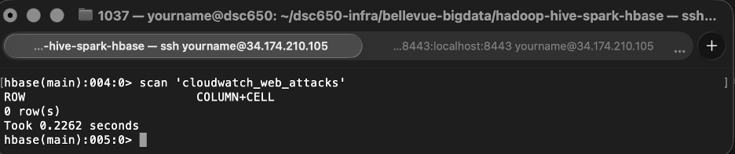
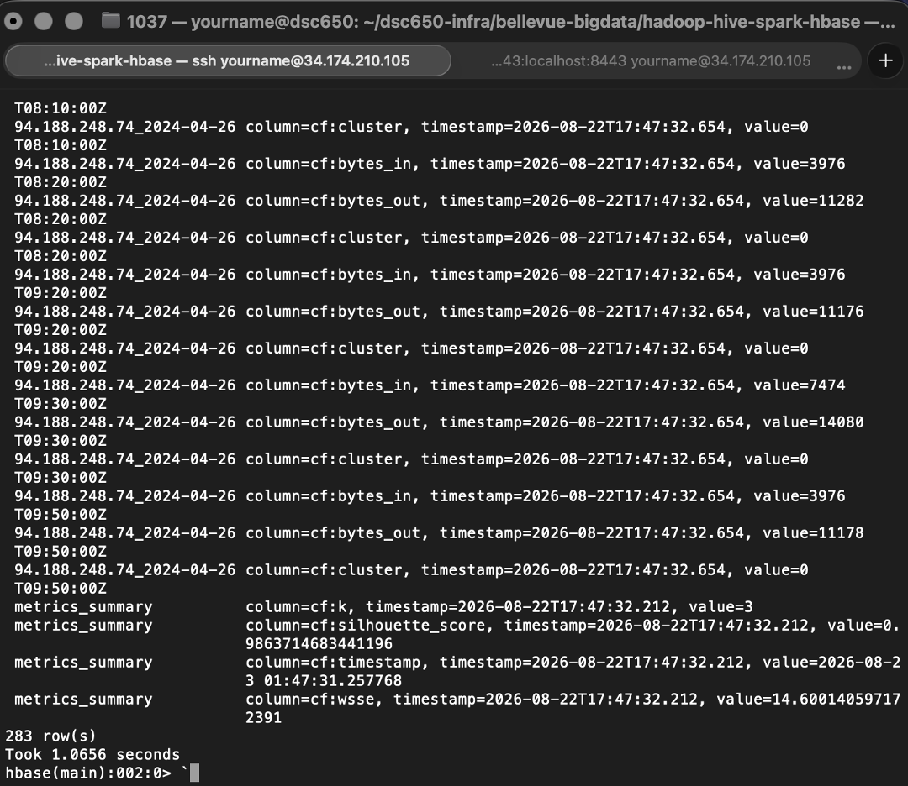

# Apache HBase — Model Metrics Persistence

## Role in the Pipeline

Apache HBase provides the NoSQL persistence layer for the machine learning metrics generated by Spark MLlib.

The HBase table is created before the Spark job runs, verified with an empty scan, populated by the PySpark application, and scanned again after execution to confirm that the model-performance metrics were successfully stored.

## Table Design

**Table name:** `cloudwatch_web_attacks`  
**Row key:** `src_ip + creation_time`  
**Column family/families:** `cf`

The cloudwatch_web_attacks HBase table uses a single column family, cf, to hold all fields. This is appropriate since the dataset doesn't have naturally distinct access patterns that would benefit from splitting fields across multiple families, and a single family keeps writes and reads simple for this project's scope. The row key for individual records is a composite of src_ip and creation_time (e.g., 136.226.64.114_2024-04-25T23:00:00Z), which gives each record a unique, human-readable key that naturally groups all traffic from the same source IP together in sorted order. A separate fixed key, metrics_summary, is used for a single row holding the model's evaluation metrics (silhouette score, WSSE, k, and timestamp), keeping aggregate pipeline metrics distinct from individual traffic records within the same table and column family.

## HBase Commands

The commands used to create and inspect the table are stored in:

[`commands.txt`](commands.txt)

## Empty Table Verification

As you can see from the scan, there are 0 rows returned for this table.

## Metrics Written by Spark

1. cf:silhouette_score — 0.9863714683441196, measures how well-separated and internally cohesive the clusters are
2. cf:wsse — 14.600140597172391, a direct readout of how tightly packed the clusters are in absolute terms
3. cf:k — 3, the hyperparameter you chose for the KMeans model
4. cf:timestamp — 2026-08-23 01:47:31.257768, the specific run that produced them

Together, these four values are the direct, unaltered output of the evaluation step in the PySpark script. Nothing here is recomputed or reinterpreted by the time it lands in HBase.

## Populated Table Verification

As you can see from the re-scan, there is 283 rows of data along with metrics output.

This final scan provides end-to-end verification that the pipeline successfully moved from ingestion and distributed storage through SQL access, machine learning, and persistent NoSQL results.
