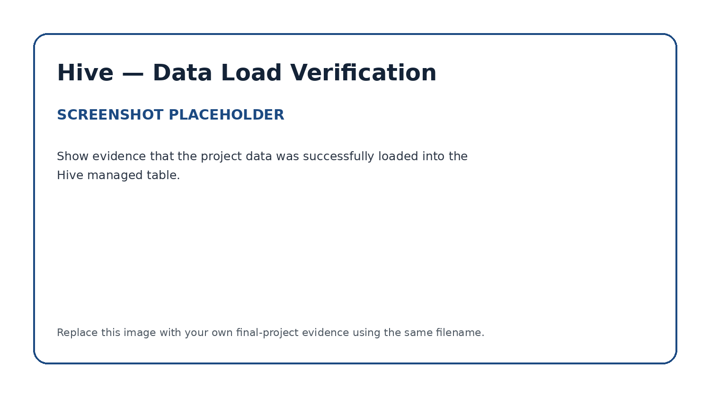
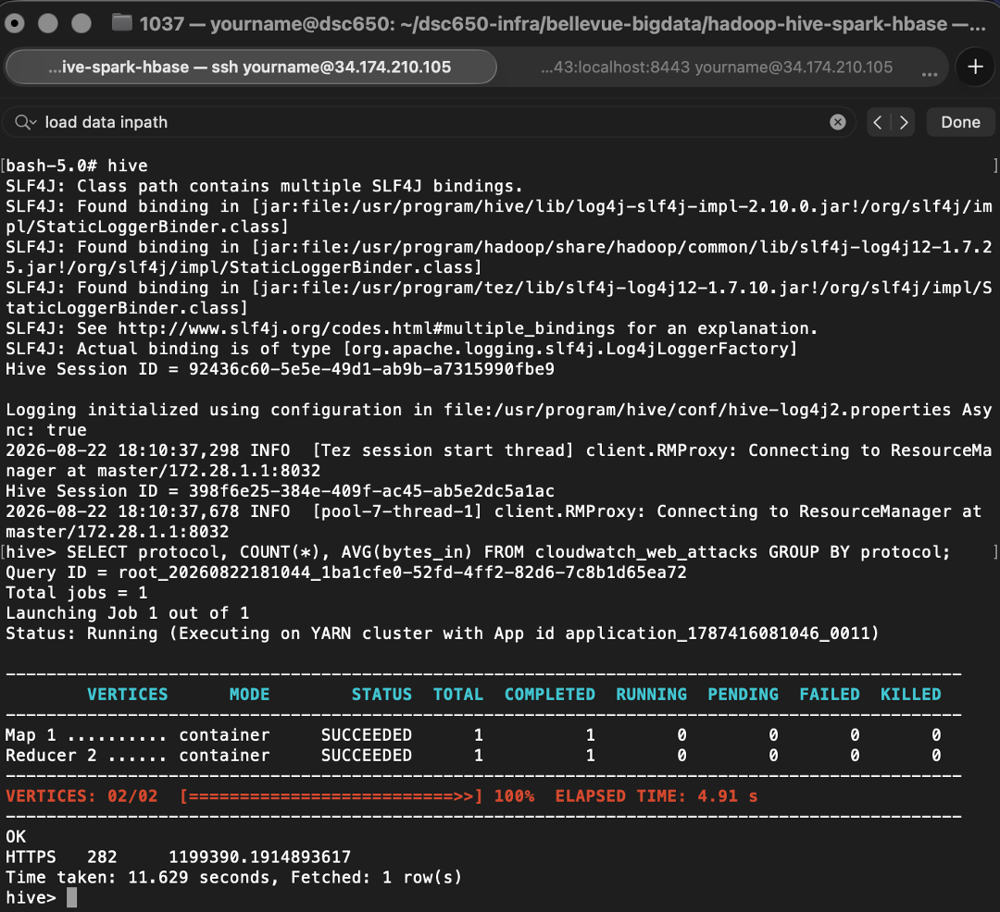

# Apache Hive — Managed Table & SQL Validation

## Role in the Pipeline

Apache Hive provides the structured SQL layer between HDFS storage and the Spark MLlib workload. The project data loaded through NiFi into HDFS is used to create and populate a Hive managed table.

## Hive Table Design

**Table name:** `cloudwatch_web_attacks`

The cloudwatch_web_attacks table schema mirrors the structure of the source CSV directly, using STRING for identifier and categorical fields (src_ip, protocol, src_ip_country_code, rule_names, etc.) and numeric types (BIGINT for byte counts, INT for port and response code) where arithmetic or aggregation would be needed. I used STORED AS TEXTFILE with ROW FORMAT DELIMITED FIELDS TERMINATED BY ',' since the source data is a standard comma-delimited CSV, and TBLPROPERTIES ("skip.header.line.count"="1") to skip the header row on load. This flat, denormalized structure keeps the table simple to query directly with Spark SQL and avoids the overhead of a star schema that this single-table dataset doesn't need. An aggregation query grouping by protocol (SELECT protocol, COUNT(*), AVG(bytes_in)...) confirmed the schema loaded correctly, returning 282 HTTPS records — consistent with the row count later verified in HBase.

## SQL Files

- [`create_tables.sql`](create_tables.sql) — table creation and data-loading SQL
- [`queries.sql`](queries.sql) — validation, exploration, and aggregation queries

## Data Load Verification

I used the simple 'SELECT * FROM cloudwatch_web_attacks' query to verify the data was loaded.

## Query & Aggregation Verification

I used an aggregation query that ran successfully through Tez. There were 282 rows that match with the 283 rows previously seen in the HBase scan minus the one metrics_summary row. This is an independent cross-check confirming the same record count made it all the way from Hive through to HBase.

The validated Hive table becomes the structured input used by the PySpark MLlib application.
