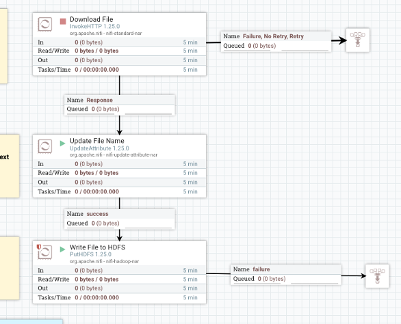
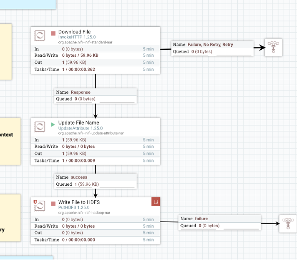
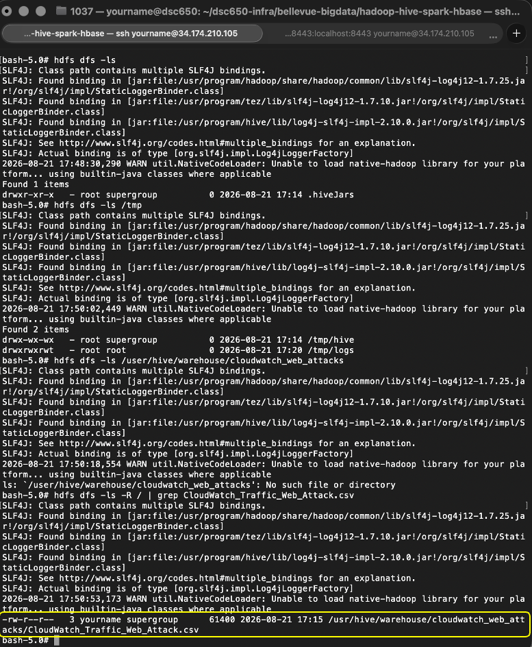

# Apache NiFi — Data Ingestion into HDFS

## Role in the Pipeline

Apache NiFi provides the ingestion and orchestration layer for this project. The completed flow retrieves the project dataset and writes it into HDFS for downstream processing.

## Source Dataset

**Dataset:** Cybersecurity: Suspicious Web Threat Interactions, Cloudwatch_Traffic_Web_Attack.csv  
**GitHub direct URL:** [Enter the direct/raw GitHub URL used by the NiFi HTTP processor]

This dataset contains web traffic records collected through AWS CloudWatch, aimed at detecting suspicious activities and potential attack attempts. The data was generated by monitoring traffic to a production web server, using various detection rules to identify anomalous patterns. This dataset is ideal for anomaly detection to develop models to detect unusual behaviors in web traffic.

## Flow Design

Describe the important processors used in the final NiFi flow and the role each processor performs.

| Processor / Process Group | Role in the Flow |
|---|---|
| [Processor name] | [What it does] |
| [Processor name] | [What it does] |
| [Processor name] | [What it does] |

Explain how data moves from the source URL through NiFi and into HDFS.

## HDFS Destination

**HDFS path:** `[Enter final HDFS path]`

Explain where NiFi writes the dataset and how the destination is used by the next stage of the pipeline.

## Execution Evidence

### Final NiFi Flow

### Running Flow / Queue Activity

### HDFS Ingestion Verification

The HDFS screenshot should show the `hdfs dfs -ls` output confirming that the project dataset was successfully written into HDFS.
