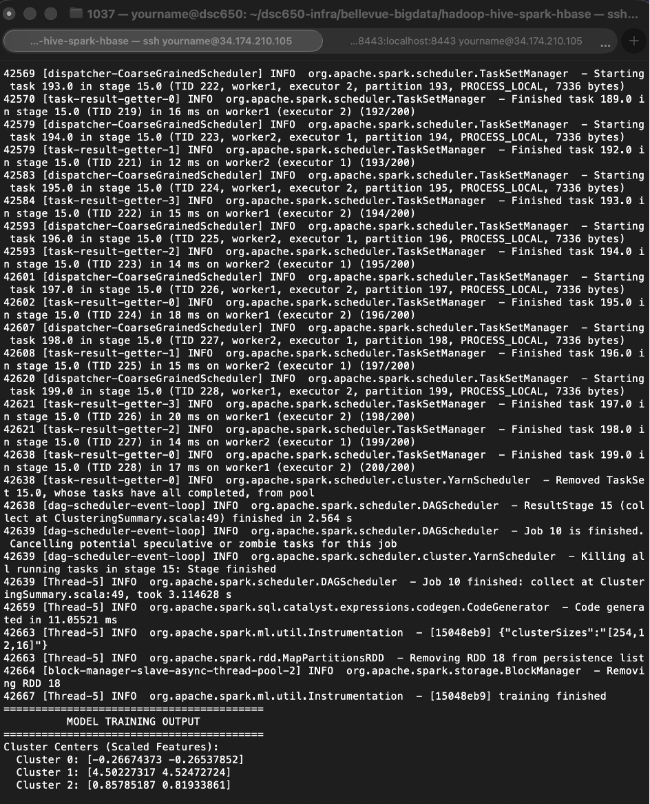
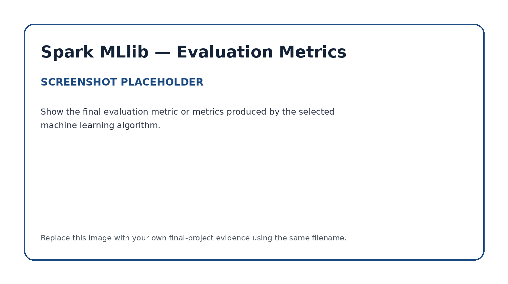

# Apache Spark MLlib — Distributed Machine Learning

## Role in the Pipeline

Apache Spark MLlib provides the distributed processing and machine learning layer for this project. The PySpark application reads project data from Hive, prepares the data for modeling, trains and evaluates a machine learning model, and generates model-performance metrics that are written into HBase.

## Hive Input

**Hive table:** `cloudwatch_web_attacks`

Spark reads from the cloudwatch_web_attacks Hive table via spark.sql("SELECT bytes_in, bytes_out, src_ip, creation_time FROM cloudwatch_web_attacks"). It pulls four of the table's 16 columns rather than the full schema.

## Data Preparation & Transformations

Describe the important preprocessing or transformation steps performed before model training.

1. Column selection focused on bytes_in, bytes_out, src_ip, and creation_time
2. Null handling removes any records missing either byte-count value, since KMeans can't operate with nulls
3. Feature vectorization with VectorAssembler combining bytes_in and bytes_out into a single vector column (raw_features)
4. Standardization with StandardScaler transforms raw_features into features by centering each value to zero mean and scaling to unit variance

## MLlib Algorithm

**Algorithm:** `K-Means clustering`

I chose K-Means clustering (k = 3) rather than a supervised classifier because this dataset has no labeled ground truth distinguishing malicious from benign traffic. Every record represents traffic that was already flagged as a suspicious web interaction, so there's no negative class to train a classifier against. Clustering instead groups records by similarity in bytes_in and bytes_out (scaled via StandardScaler) to surface natural structure in the traffic volume patterns, which can help identify distinct behavioral profiles (e.g., low-volume probing versus high-volume data exfiltration attempts) without requiring labels. The model achieved a silhouette score of 0.9863, indicating very well-separated, cohesive clusters, with a within-cluster sum of squared errors (WSSE) of 14.60. The high silhouette score suggests the three clusters correspond to genuinely distinct traffic volume regimes in this dataset rather than an arbitrary split, though with only two features driving the clustering, the practical security interpretation of each cluster would benefit from incorporating additional fields (e.g., protocol, response_code) in future iterations.

## Training & Evaluation

After selecting the two numeric fields, the pipeline drops nulls, assembles bytes_in/bytes_out into a feature vector via VectorAssembler, and standardizes that vector with StandardScaler (zero mean, unit variance) so neither field dominates the distance calculation. KMeans(k = 3, seed = 42).fit() then trains on the scaled features, and model.transform() assigns every record to one of the three clusters.

Two evaluation metrics are computed afterward:

- Silhouette score, via ClusteringEvaluator, measuring how well-separated and cohesive the resulting clusters are (range -1 to +1)
- WSSE (within-set sum of squared errors), pulled from model.summary.trainingCost that calculatese the total squared distance from each point to its assigned cluster center, which is the quantity KMeans directly minimizes during training

**Primary evaluation metric(s):** `Silhouette score and WSSE`

The silhouette score came out to 0.9863, indicating the three clusters are extremely well-separated with almost no ambiguously-placed points near a cluster boundary. WSSE was 14.60, combined with the high silhouette score, it supports the conclusion that k = 3 captures genuine, distinct structure in traffic volume (bytes in vs. out) rather than an arbitrary or forced partition.

### Training Output



### Model Evaluation



## Spark Submit / YARN Execution

```bash
spark-submit \
  --master yarn \
  --deploy-mode client \
  --name CloudWatch_KMeans_to_HBase \
  spark_kmeans.py
```

Logs confirm it ran on Spark 3.0.0 against a YARN cluster, distributing tasks across worker1 and worker2 executors. The console output includes the MODEL TRAINING OUTPUT section (cluster centers, sample predictions) and the EVALUATION METRICS section (silhouette score, WSSE), followed by a final confirmation line, Wrote predictions and metrics to HBase table cloudwatch_web_attacks, printed after the happybase write step completed without error.

## HBase Output

List the model-performance metrics written by Spark into HBase and explain how the application connects the machine learning stage to the final persistence layer.

**PySpark source files:** [`analysis.py`](analysis.py)
